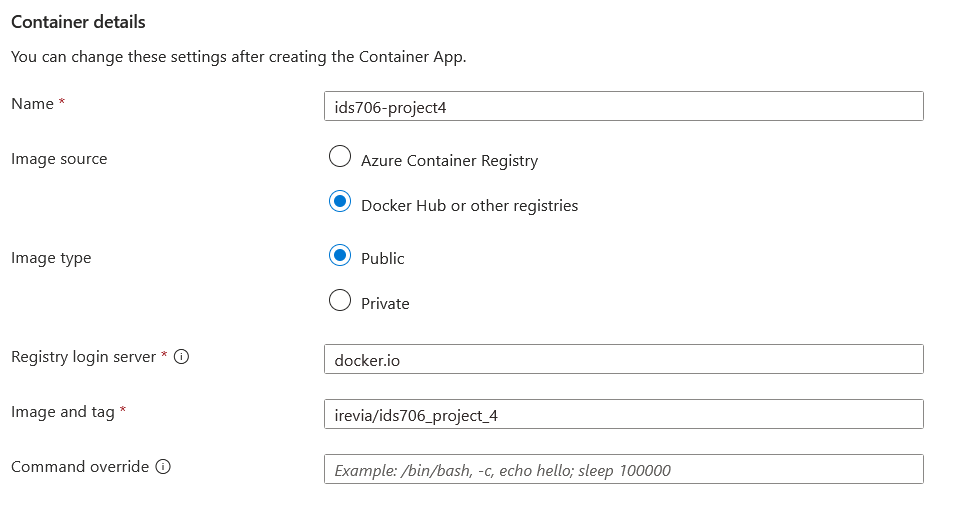
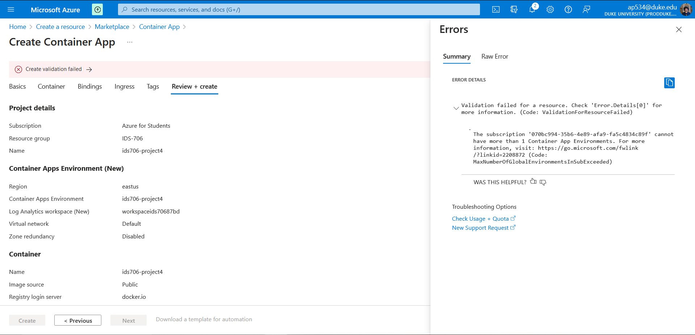

# Flask Chatbot with GPT-2

This project is a simple Flask application that integrates a chatbot powered by the GPT-2 model. The chatbot can generate responses based on user input, making it a fun and interactive way to explore the capabilities of GPT-2.

## Dependencies

This project requires Python 3.7 or later and the following Python libraries installed:

- Flask
- Transformers

You can install these dependencies using pip:

```bash
pip install -r requirements.txt
```

## Project Structure
The project has the following structure:

app.py: This is the main file that runs the Flask application.

gpt2_chatbot.py: This file contains the GPT2Chatbot class, which uses the GPT-2 model from the transformers library to generate responses.

templates/: This directory contains the HTML templates for the Flask app.

static/: This directory contains static files like CSS and images.

requirements.txt: This file lists all of the Python dependencies for the project.

Dockerfile: This file is used to build a Docker image for the project.

### To run the program, you can use the following command:

```
python app.py
```

This will start the Flask development server, and the app will be accessible locally.

## Docker Deployment

This project includes a Dockerfile for building a Docker image of the app. You can build the image using the following command:


```
docker build -t my-flask-app .
```

And then run it with:

```
docker run -p 4000:80 my-flask-app
```

The container is built and stored in a repository in Dockerhub: https://hub.docker.com/repository/docker/irevia/ids706_project_4

## Deployment

The Docker image from Dockerhub is used to directly build a container app:



However, as I have already run out of credits and exceeded the number of container app deployments allowed on Azure, I am unfortunately prevented from deploying the app succesfully.



## Conclusion and Recommendations

This project demonstrates the simple nature of GPT 2 and provides a clean and basic interface to chat with what is already considered to be an outdated version of itself, providing a simple archived way to interact with very old forms of GPT.